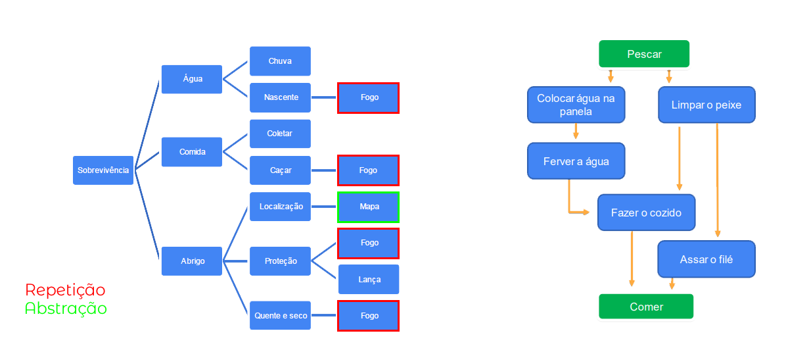

# 🧠 Aula 1: Pensamento computacional

## 💭 Introdução ao pensamento computacional

Conceito:

> _Processo de pensamento envolvido na expressão de soluções em passos computacionais ou algoritmos que podem ser implementados no computador_ (Aho, 2011; Lee, 2016)

### Principais pilares:

#### 1. Decomposição:

- Dividir um problema complexo em subproblemas.

#### 2. Reconhecimento de padrões

- Identificar padrões ou tendências
- Similaridades e diferenças entre os problemas

#### 3. Abstração

- Extrapolar o conceito do problema para um forma generalista

#### 4. Design de algoritmos

- Definir passo a passo a solução do problema.

## ✨ Habilidades complementares

### Raciocínio Lógico

Pensamento Lógico estruturado que permite encontrar conclusões ou deduções na resolução de um problema.

#### 1. Indução

- Relacionado as Ciências Experimentais (empirismo)
- Fenômenos observados

#### 2. Dedução

- Relacionado as Ciências exatas
- Previsões e explicações

#### 3. Abdução

- Processo investigativo
- Premissa
- Conclusão

### Aperfeiçoamento

A partir de uma solução, determinar pontos de melhora e refinamento.

- Encontrar solução eficiente
- Otimizar processos
- Simplificar linhas de códigos
- Funções bem definidas

## 🏛️ Pilares: Decomposição

### Estratégias:

- Processo de quebrar e determinar partes menores e gerenciáveis
- Combinar os elementos recompondo o problema original
- Ordem de execução de tarefas menores

## 🏛️ Pilares: Padrões

### Reconhecimento de Padrões:

- Modelo base
- Estrutura invariante
- Repetição

> Generalizar, com objetivo de obter resolução para problemas diferentes.

### Aplicações:

- Classificação de dados
- Reconhecimento de imagem
- Reconhecimento de fala
- Análise de cenas
- Classificação de documentos

## 🏛️ Pilares: Abstração

> ABSTRAIR: Observar, um ou mais elementos, avaliando características e propriedades em separado.

> ABSTRAÇÃO: Processo intelectual de isolamento de um objeto da realidade.

> GENERALIZAR: Tornar-se geral, mais amplo, extensão.

> **Generalização**, na lógica, é a operação intelectual que consiste em reunir numa classe geral, um conjunto de seres ou fenômenos similares

### Como classificar os dados?

- Características
- Pontos essenciais
- Generalizar x detalhar

### Aplicações:

- _Merge sort_, _Clustering_, Busca Binária
- Árvore, Listas, Grafos
- Máquina de estado finito
- Linguagens de programação

## 🏛️ Pilares: Algoritmos

> Um computador não opera sozinho, precisa de instruções detalhadas.

### Desenvolvimento do Programa

- **Análise**: Estudo e definição dos dados de entrada e saída.
- **Algoritmo**: Descreve o problema por meio de ferramentas narrativas, fluxograma, ou pseudocódigo.
- **Codificação**: O algoritmo é codificado de acordo com a linguagem de programação escolhida.

### Como construir um algoritmo?

- Compreensão do problema
- Definição dados de entrada
- Definir processamento
- Definir dados de saída
- Utilizar um método de construção
- Teste e diagnóstico

### Construção de algoritmos

- Narrativa
- Fluxograma
- Pseudocódigo

## 🔥 Estudo de caso conceitual: perdido

## 💻 Estudo de caso aplicado: soma de um intervalo

### 🧮 Algoritmo:

#### Passo 1 – Recebe os valores (x e y)

> Leia (x, y)

#### Passo 2 – Resolva:

> y/2 = total

#### Passo 3 – Resolva:

> y+x = resultado_parcial

#### Passo 4 – Ache o total

> Final = total x resultado_parcial

#### Passo 5 – Imprima o resultado

> Imprima (Final)

## 🤔 Estudo de caso aplicado: adivinhe o número

O problema consiste em determinar o número escolhido por uma pessoa dentro de um intervalo.

### 🔎 Busca binária:

Passo 1 – Ordenar o vetor

Passo 2 – Módulo de L/2

Passo 3 – Acessar estrutura

Passo 4 – Comparar valores

Passo 5 – Repita até encontrar o número

Passo 6 – Imprima "Busca bem sucedida"

# 🎳 Aula 2: Introdução à Lógica de programação

Definição:

> Parte da filosofia que trata das formas do pensamento em geral (dedução, indução, hipótese, inferência etc.) e das operações intelectuais que visam à determinação do que é verdadeiro ou não.

> Organização e planejamento das instruções, assertivas em um algoritmo, a fim de viabilizar a implantação de um programa.

## 🧩 Técnicas de Lógica de Programação

### Técnica Linear

- Modelo tradicional
- Não tem vínculo
- Estrutura hierárquica
- Programação de computadores

### Técnica Estruturada

- Maior nível de complexidade
- Não linearidade

### Técnica Modular

- Controlada por um conjunto de regras
- Modulação
